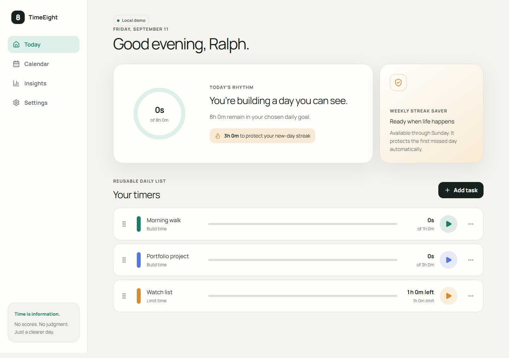
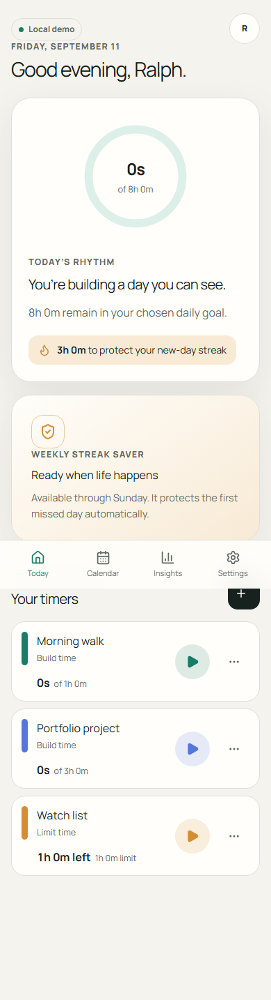
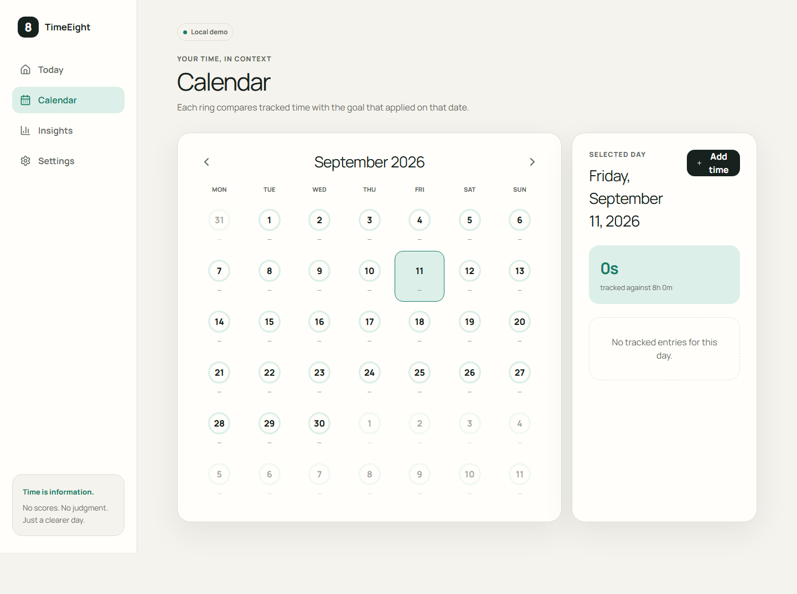

# TimeEight

A calm, local-first timer for intentionally spending—or limiting—time across your day.



TimeEight tracks all chosen time without labeling leisure or work as more valuable. Build-time tasks count up toward an “at least” target; limit-time tasks count down and ask before continuing past an allowance.

## What works

- Concurrent, timestamp-based timers with one active timer per task.
- IndexedDB checkpoints, offline mutations, server reconciliation, and crash recovery.
- Reorderable task templates with keyboard and button alternatives.
- A fixed eight-hour daily goal with preserved history, a timer-only three-hour streak, and one weekly streak saver.
- Calendar rings, duration-based corrections, neutral records, JSON export, and deletion.
- Supabase Auth/PostgreSQL with tested row-level security.
- Responsive light/dark UI and an installable Serwist PWA shell.

<details>
<summary>More screenshots</summary>





</details>

## Stack

Next.js App Router, React, strict TypeScript, Tailwind CSS, Radix UI, Supabase, Dexie, Serwist, Zod, dnd-kit, Vitest, Playwright, pgTAP, and axe-core.

## Local setup

Requirements: Node.js 22+, pnpm 11, and Docker Desktop for the local Supabase stack.

```bash
pnpm install
cp .env.example .env.local
pnpm supabase start
pnpm dev
```

Copy the local Supabase URL and publishable key into `.env.local`. The app falls back to an account-free local demo when Supabase is not configured.

Useful checks:

```bash
pnpm format:check
pnpm lint
pnpm typecheck
pnpm test
pnpm test:e2e
pnpm supabase test db
pnpm build
```

## Architecture and security

Timer, calendar, aggregation, and streak rules live in framework-independent TypeScript modules. IndexedDB is the immediate local store; UUID-backed mutations synchronize to Supabase when online. PostgreSQL derives summaries from immutable time entries rather than mutable counters.

Every exposed table uses row-level security and least-privilege grants. Server clients are request-scoped, secret keys stay server-only, auth callbacks validate redirect paths, public email auth is gated behind SMTP and Turnstile configuration, and the service worker caches only static assets plus a data-free offline page. See [SECURITY.md](SECURITY.md) for reporting.

## Deploying

1. Create a managed Supabase project and apply `supabase/migrations` before the web release.
2. Configure Google OAuth and exact production/preview redirect allowlists.
3. Import the repository into Vercel and add the variables from `.env.example`.
4. Keep `NEXT_PUBLIC_ENABLE_EMAIL_AUTH=false` until custom SMTP and Turnstile are configured.
5. Run a preview smoke test before promoting to production. Do not run destructive migrations from preview deployments.

The first public Vercel URL will be added after the production project is linked.

## License

[MIT](LICENSE)
