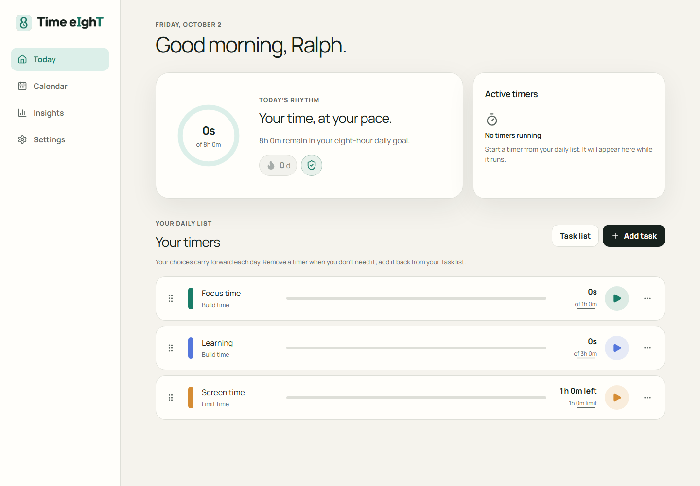
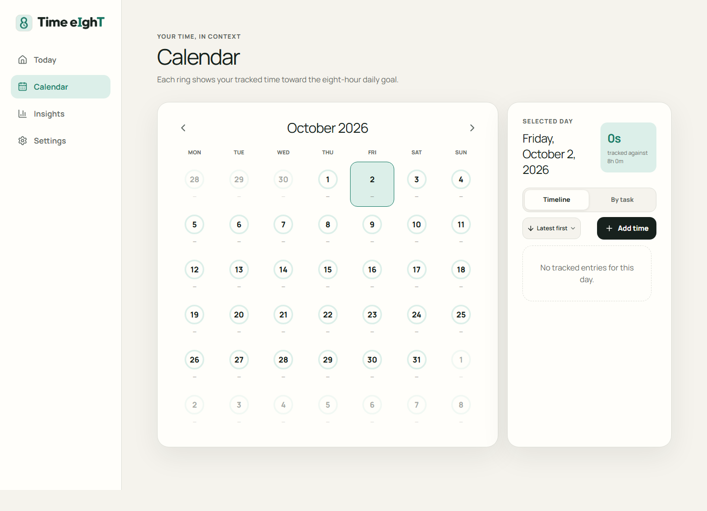
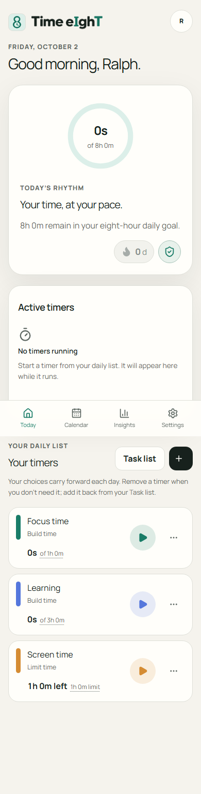

# TimeEight

**Start a timer. Understand your day.**

TimeEight is a personal, progress-based time tracker for seeing where your time goes. Start a timer when something begins, stop it when you are done, and build a clear record of your day without having to plan every hour in advance.

[Open TimeEight](https://timeeight.vercel.app/)

## Why TimeEight exists

A day can feel busy while still being difficult to explain. Traditional calendars show what was scheduled, but not necessarily what happened. Many time trackers are designed for billing, timesheets, or rigid productivity systems.

TimeEight focuses on a simpler question: **what did you spend time on today?**

It is built around a time-based process goal: choosing how much time you want to put into something, then making that effort visible. If you want to spend three hours on a project today, for example, the running timer shows your progress even before the project itself is finished. Completing that time goal gives the day a concrete finish line and a small win.

Your completed timers become a readable daily picture. You can look back at individual sessions, compare days, and notice patterns without rebuilding your day from memory.

## Two ways to think about time

Some activities are things you want to spend more time doing. Others are things you want to keep within a boundary. TimeEight supports both:

- **Build time** counts upward toward an intention, such as learning, exercising, or working on a project.
- **Limit time** counts downward from an allowance, such as screen time or another activity you want to keep in view.

Different tasks can run at the same time when real life overlaps. If a limit is reached, TimeEight pauses and lets you decide whether to continue.

## Your time, from today to the bigger picture

- **Today** shows what is running, how much time remains, and how the day is taking shape.
- **Calendar** turns past days into a visual history and lets you inspect or correct individual entries.
- **Insights** summarizes tracked time across days and tasks so longer-term patterns are easier to see.

TimeEight is designed for both desktop and mobile, with light and dark themes and controls that stay usable with touch, a mouse, or a keyboard.

  

## Made for everyday interruptions

Timers use their real start and stop times, so switching tabs or putting a device to sleep does not make the clock drift. Checkpoints help recover an interrupted session, and signed-in accounts can continue across devices without creating duplicate history.

You can correct past durations, export a personal backup, and remove your account when you no longer want it. TimeEight keeps the record useful without turning it into a schedule you have to obey.

## License

[MIT](LICENSE)
